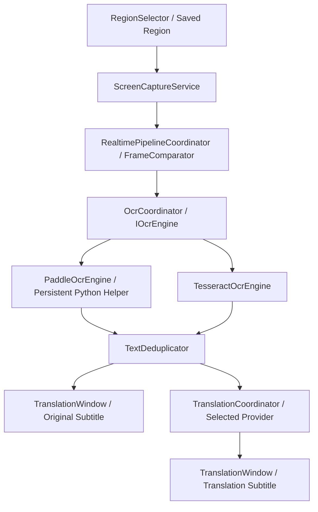
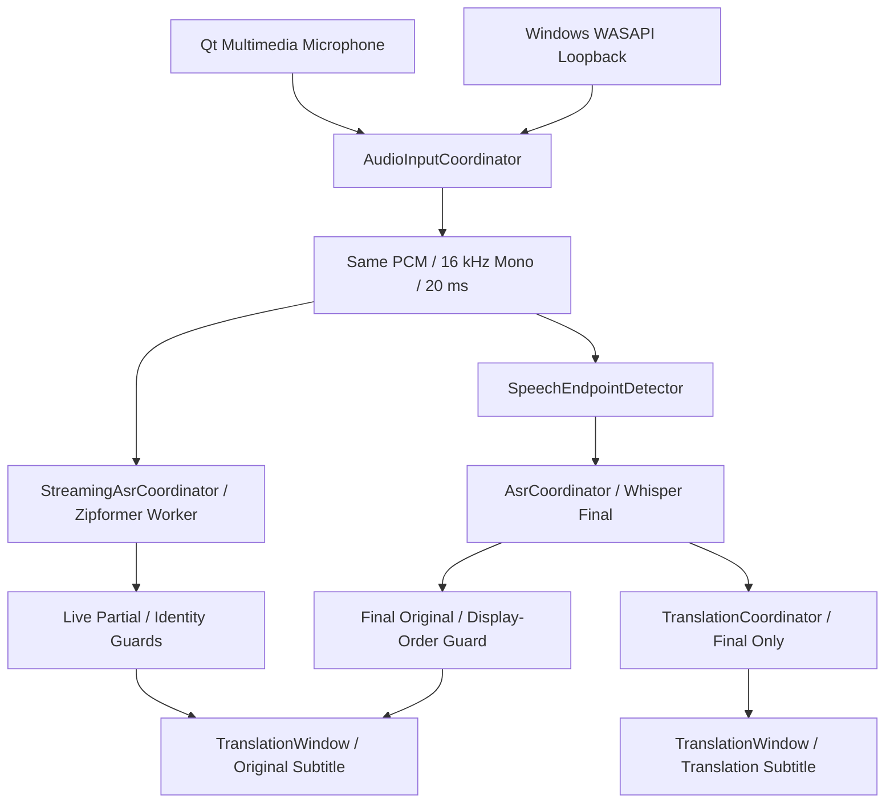

# Translator

Translator 是一个基于 Qt 6 / C++ 的 Windows 实时字幕与翻译应用，支持屏幕区域文字、
麦克风语音和系统播放音频三类输入。它将本地 OCR / ASR 识别结果显示在悬浮字幕窗口中，
并可通过 DeepL 或 OpenAI-compatible 服务生成翻译字幕。

项目参考 LunaTranslator 的产品与功能思路，采用自己的 Qt/C++ 模块化实现。
当前主要开发与验收平台为 Windows 11，不宣称 Linux、macOS 或其他平台已完成支持。

> Functional Development: Complete
>
> Core Functional Acceptance: PASS
>
> Public Release / Installer / Full Release Engineering: Out of Scope

以上状态指课程项目范围内、已测试环境中的核心功能，不代表所有识别内容均准确，
也不代表第三方组件的公开再分发已获许可。详细设计和历史验收记录保留在 `docs/`。

## 核心功能

### 屏幕 OCR 翻译

- 使用 Region 在一个显示器内框选屏幕区域，保存上次有效选区。
- Start 后周期截图，通过帧变化检测减少重复 OCR，通过文本去重减少重复翻译。
- 支持常驻 Python helper 驱动的 PP-OCRv6 Small，以及可选 Tesseract 后端。
- OCR 在后台执行，只保留最新待处理帧，避免输入无限积压。
- 原文与译文实时显示；Stop 后旧会话结果不会重新覆盖字幕。

Tesseract fallback 是用户在 Settings 中手动选择的备选方案，不是失败后静默切换。
两种引擎都需要提前准备对应运行时与语言资源。

### 麦克风实时字幕与翻译

- 使用 Qt Multimedia / QAudioSource 采集所选麦克风。
- 转换为统一的 16 kHz、mono、int16 LE PCM，每块 20 ms。
- 可选 Zipformer Streaming ASR 在讲话期间更新原文 Partial。
- Energy-based endpointing 判断句段结束，再由 Whisper 生成 Final。
- 仅将非空 Whisper Final 送入翻译，不对每次 Partial 发起网络请求。

### 系统音频实时字幕与翻译

- 使用 Windows WASAPI loopback 采集所选输出设备的播放音频。
- 不需要通过麦克风拾取扬声器声音，适合视频、课程或其他播放内容。
- 复用同一套 Streaming Original、Whisper Final 和翻译协调逻辑。
- 三种模式互斥；切换模式停止旧管线，再次 Start 才开始新输入。

### 字幕窗口

- 无边框、置顶的 floating overlay，译文在上、原文在下。
- Interactive / ClickThrough 切换，ClickThrough 时隐藏 toolbar。
- Drag Lock 独立控制拖动与缩放，不影响识别管线。
- 可调译文/原文字号、字幕背景透明度及字段显示，至少保留一个字段可见。
- Windows capture exclusion 尽量避免截图包含自身字幕。
- System Tray 提供 Show/Hide、交互模式、Lock、Region、Start/Stop、Settings 和 Exit。
- 隐藏窗口不停止管线；恢复显示后可查看最新字幕。

### 翻译后端

| Provider | 用途 | 配置 |
| --- | --- | --- |
| None | 只做本地识别和原文字幕，不发送翻译请求 | 无需 API key |
| DeepL | 在线文本翻译 | Free/Pro 和 API key |
| OpenAI Compatible | 兼容 Chat Completions 的文本翻译服务 | Base URL、Model、API key |

## 系统架构

### Screen OCR Pipeline



截图由 Qt 屏幕 API 获取，OCR 在独立 worker 中处理。会话和请求标识拒绝过期结果；
翻译与 GUI 不直接依赖具体 OCR 实现。Region 本身也进行一次截图与识别检查。

### Audio Pipeline



同一份 PCM 一分为二，不会为两个 ASR 各开一个麦克风。`ProductionInputController`
协调 Start/Stop 和模型准备；模型在后台加载完成后才开始采集。

## 实时语音识别架构：双 ASR 设计

Whisper Final-only 需要等待句段结束；Streaming Zipformer 可以在讲话过程中逐步产出文本，
改善等待字幕的主观延迟。因此两者分工为 **fast preview + final correction**，
Zipformer 不替代 Whisper，也不直接提供翻译输入。

| 结果 | 来源 | 显示与处理 |
| --- | --- | --- |
| Partial | Zipformer Streaming ASR | 快速预览，可增加、缩短或修正；只更新 Original |
| Final | Whisper ggml-base | 句段结束后更新最终原文，并进入翻译 |
| Translation | 所选 Provider | 对 Final 处理完成后更新译文 |

迟到的 Partial 不能覆盖已应用的 Final，旧句段的 Final 不能覆盖较新句段的 live Original。
新句段说话期间，译文可以暂时保留上一句已完成的翻译。
Final correction 表示采用 Whisper 最终结果，不保证每次都比 Partial 更准确。

Streaming 使用独立 worker 和有界 PCM 队列；超出容量时明确降级为 Final-only，
不会悄悄丢失中间音频后继续声称识别连续。普通 Stop/Start 保留 warm models。

## 项目结构

```text
src/
  main.cpp       应用初始化与模块连接
  app/           输入模式、管线、生命周期和结果协调
  audio/         麦克风、WASAPI、PCM 转换与语音端点检测
  asr/           Whisper / Streaming ASR 接口、后端与 worker
  capture/       屏幕选区与截图
  config/        QSettings、音频、外观与快捷键配置
  credentials/   Windows 安全凭据存储
  gui/           字幕窗口、Settings 和 System Tray
  ocr/           OCR 接口、引擎、预处理与运行时定位
  processing/    帧比较与文本去重
  translator/    翻译接口、Provider 工厂、语言映射与网络后端
  platform/      Windows capture exclusion
helpers/         常驻 OCR Python helper 与依赖清单
tests/           自动化回归和本地验证工具
tools/           OCR / Streaming ASR 评估工具
scripts/         本地运行时准备、审计与包验证工具
docs/            架构、测试数据与阶段验收文档
```

模型、运行库和私有 QA 输入不属于源码目录，不随 Git 仓库提供。

## 技术栈与开发环境

| 技术 | 使用方式 |
| --- | --- |
| C++17 / Qt 6 Widgets | 应用协调、透明字幕窗口和设置界面 |
| Qt Core / Gui / Network / Multimedia | 事件、图像、异步翻译请求与麦克风采集 |
| CMake / Ninja / MinGW | Windows 构建工具链 |
| PaddleOCR / PaddlePaddle / PaddleX | 可选本地 Python OCR helper 运行时 |
| Tesseract | 可选本地动态库和 traineddata |
| whisper.cpp | 显式启用、固定源码版本的 CPU Final ASR |
| sherpa-onnx / ONNX Runtime | 显式启用的 Streaming ASR SDK 与动态运行库 |
| Windows WASAPI | 系统输出音频 loopback |
| DeepL / OpenAI-compatible API | 可选在线翻译 |

已验证环境：Windows 11、Qt 6.11.2、MinGW 13.1、CMake、Ninja。
CMake 最低版本为 3.20；工程要求 Qt 6，上述版本是验证环境，不是跨版本兼容承诺。
基础构建也需要 Qt Multimedia，不是仅安装 Core / Gui / Widgets 即可。

## 构建

### 基础构建

在已配置 MinGW 的 PowerShell 中执行，将占位符替换为本机安装位置：

```powershell
cmake -S . -B build/normal -G Ninja `
  -DCMAKE_BUILD_TYPE=Release `
  -DCMAKE_PREFIX_PATH="<QtPath>"
cmake --build build/normal
ctest --test-dir build/normal --output-on-failure
```

`<QtPath>` 应指向匹配 MinGW 的 Qt kit。运行前确保 Qt 的 `bin`、MinGW 的 `bin` 和 Ninja
可由 `PATH` 找到；程序输出为 `build/normal/Translator.exe`。也可用 Qt Creator 打开
`CMakeLists.txt`，选择对应 kit 和 Translator 运行目标。

基础构建支持 Screen UI 和 OCR 接入，但 OCR 运行时仍需准备。
未启用 Whisper 的构建会提示语音识别不可用；构建成功不等于模型已安装。

### 可选 ASR 支持

完整双 ASR 构建需要准备固定版本的 whisper.cpp 源码、sherpa-onnx SDK 和 Windows DLL：

```powershell
cmake -S . -B build/audio -G Ninja `
  -DCMAKE_BUILD_TYPE=Release `
  -DCMAKE_PREFIX_PATH="<QtPath>" `
  -DTRANSLATOR_WHISPER_CPP_DIR="<whisper.cpp-path>" `
  -DTRANSLATOR_SHERPA_ONNX_DIR="<sherpa-onnx-sdk-path>" `
  -DTRANSLATOR_SHERPA_RUNTIME_DIR="<sherpa-onnx-runtime-path>"
cmake --build build/audio
ctest --test-dir build/audio --output-on-failure
```

Whisper 源码固定为 `48f628a84833905ee4a0658ee6d4a5c915ce1997`，CMake 会检查该版本。
sherpa-onnx 为 1.13.8，ONNX Runtime 为 1.28.2；SDK 提供对应 C API headers 和 libraries。
Windows runtime 目录需含 `sherpa-onnx-c-api.dll`、`onnxruntime.dll` 和
`onnxruntime_providers_shared.dll`，CMake 将它们复制到 executable 目录。

只配置 Whisper 参数可构建 Final-only 音频版本。Streaming 模型或 DLL 不可用时，
完整版本明确提示 preview 不可用并保留 Whisper Final 路径。CMake 不自动下载依赖或模型。
部分自动测试使用 Python；可追加 `-DPython3_EXECUTABLE="<python-executable>"`
明确选择解释器，避免漏掉已有 Python 测试套件。

**源码状态说明：** 本页描述已验收的当前工作树。Streaming production integration 的实现改动
目前仍未提交；仅克隆当前已提交源码不能复现完整双 ASR 功能及新增构建参数。
README 更新不会代替这些实现的提交。

## 模型与本地运行时

模型需自行准备；应用不会自动下载，权重和第三方 runtime 不提交 Git。
缺失或不匹配的文件产生明确错误，不会从网络补齐。

### OCR

PP-OCRv6 Small 使用本地 det / rec 模型和 Python helper。依赖版本见
[`helpers/ocr/requirements.txt`](helpers/ocr/requirements.txt)：PaddleOCR 3.7.0、
PaddlePaddle 3.3.1、PaddleX 3.7.2。当前 Windows 配置明确禁用 MKL-DNN。

开发运行可设置 `TRANSLATOR_OCR_PYTHON`、`TRANSLATOR_OCR_HELPER` 和
`TRANSLATOR_OCR_MODELS`，分别指向 Python executable、helper 脚本和模型根目录。
模型目录下需要 `PP-OCRv6_small_det/PP-OCRv6_small_det_infer/` 与
`PP-OCRv6_small_rec/PP-OCRv6_small_rec_infer/`，各含 inference 配置与权重。
既有本地包布局使用 executable 旁的 `ocr/runtime/`、`ocr/helper/`、`ocr/models/`；
源码开发默认路径属于历史评估环境，不能视为已附带运行时。

Tesseract 需匹配的动态库及 traineddata。其 `auto` 是 English fallback，
不等于 OCR 自动语言检测；其他语言需要对应资源，实际可用性取决于运行时。

### Final ASR

已验证模型为 multilingual Whisper **ggml-base**。
先检查 Settings 中的 ASR Model 路径，再检查 executable 旁的 `models/ggml-base.bin`。
ASR language 与翻译 Source/Target Language 分开配置。

### Streaming ASR

已验证模型为 **sherpa-onnx-streaming-zipformer-bilingual-zh-en-2023-02-20**，
固定官方 int8 配方：encoder / joiner 为 int8，decoder 为 FP32。
先查 `TRANSLATOR_STREAMING_MODEL_DIR`，再查 executable 旁的
`models/streaming/zipformer/`；目录包含：

```text
encoder-epoch-99-avg-1.int8.onnx
decoder-epoch-99-avg-1.onnx
joiner-epoch-99-avg-1.int8.onnx
tokens.txt
```

后端核对固定模型 hash。Streaming 当前面向中英文，不能将 Whisper 语言支持
自动推导为 Zipformer 支持范围。模型来源和 identity 见下方 Streaming 验收文档。

## 使用方法

首次运行先打开 Settings，准备 OCR / ASR 资源并选择 Provider。
使用 None 可以先验证本地识别；在线翻译还需要有效凭据和网络。

### Screen

1. 在 toolbar、tray 或 Settings 选择 Screen，配置 OCR Engine 和 Source/Target Language。
2. 点击 Region，拖出字幕区域；Escape 可取消，过小选区不会保存。
3. 点击 Start，持续显示原文及可选翻译；Stop 结束，再次 Start 使用有效保存选区。

### Microphone

1. 在 Settings 选择 Microphone Device、ASR Model、ASR language 和翻译配置。
2. 选择 Microphone，Start 后等待模型就绪和 Listening。
3. 讲话时观察 Original；完整 Streaming 配置下，原文随语音更新。
4. 句段结束后 Whisper Final 更新原文，Provider 随后显示译文；Stop 停止采集。

### System Audio

1. 在 Settings 选择 Output Device，确认播放程序使用该设备，配置 ASR 与语言。
2. 选择 System Audio，点击 Start，然后播放音频或视频。
3. 查看 Streaming Original 和句末 Final / 翻译；Stop 结束 loopback，不会打开麦克风。

启动只恢复模式选择，不自动采集。音频模式禁用 Region，更改音频配置后应 Stop/Start。
Hide 仅隐藏窗口，Close 或 Tray Exit 才退出并清理 worker / helper。

## 设置与翻译配置

Settings 提供 Input Mode、OCR Engine、Source/Target Language、Translation Provider、
Microphone/Output Device、Whisper ASR Model、ASR language、Appearance 和 Shortcuts。
配置由 QSettings 持久化，API key 不写入 QSettings。

- **DeepL：** 选择 Free/Pro，通过 Configure / Replace 输入 key，再 Apply/OK。
- **OpenAI Compatible：** 填 API Base URL、实际 Model ID 和 key；Base URL 不是完整
  `/chat/completions` 地址，程序会追加该路径。
- **None：** 不发翻译请求，保留本地识别与原文显示。

Windows key 存入 Credential Manager。DeepL 支持 `DEEPL_API_KEY` 环境变量作为
已保存 GUI 凭据之后的 fallback；不要将 key 写入仓库。
OpenAI-compatible 使用非 streaming Chat Completions，不保证适配所有模型或服务；
远端要求 HTTPS，仅 loopback host 可用 HTTP，当前仍要求 API key。

## 快捷键

| 默认快捷键 | 功能 |
| --- | --- |
| Ctrl+Alt+T | 切换 Interactive / ClickThrough |
| Ctrl+Alt+R | Screen 模式选择 Region |
| Ctrl+Alt+S | 当前输入的 Start / Stop |

三组全局快捷键可在 Settings 配置并保存。Windows 注册可能与其他软件冲突；
可改用其他组合，或使用 toolbar / tray，不假定默认键在所有机器均可用。

## 隐私与数据处理

OCR / ASR 在本地运行。启动不会自动打开麦克风，只有 Start Microphone 才开始采集。
正常识别不保存录音；Debug 截图在本机临时目录覆盖保存一张调试图，Release 不写该图。
显式启用诊断可能记录识别文本，调试文件应按内容隐私妥善处理。

DeepL / OpenAI-compatible 将识别后的**文本**发送至对应服务，不是原始屏幕图片或音频。
在线翻译受服务隐私规则、网络和额度影响，不能称整个应用 100% offline。
Provider None 在模型和 runtime 已备妥时可以只做本地识别。

## 当前验证状态

PASS 指已记录的环境与用例通过，不是通用准确率或所有设备兼容保证。

| 功能 | 验证状态 |
| --- | --- |
| Screen Region / 周期 OCR / 去重 | 核心链与自动回归通过；完整连续视频长期覆盖有限 |
| PP-OCRv6 Small / OCR 到翻译字幕 | PASS；真实字幕及 helper 生命周期已验证 |
| 麦克风与 WASAPI loopback capture | PASS；已测试设备范围 |
| 英/中文 Streaming Original | PASS；正式应用讲话/播放结束前显示原文 |
| Whisper Final correction / Final-only translation | PASS；实测与身份顺序自动测试 |
| 静音、Stop/Restart、warm model reuse | PASS |
| Streaming / Whisper inference / 翻译 pending 时退出 | PASS；未发现残留 Translator 进程 |
| ClickThrough、Drag Lock、Tray 与基本外观 | Core PASS；环境专属检查仍有未覆盖项 |

最近完整回归：普通 Release/Debug 各 **26/26**，Whisper Release/Debug 各 **27/27**，
Zipformer + Whisper Release/Debug 各 **27/27**。标准 CTest 不依赖真实模型、麦克风或在线
凭据；真实输入质量由单独人工测试记录。

## 已知限制

- Partial 随后续声音修正，短词可能等到 Final 才显示，不能保证即时出字。
- ASR 受麦克风、噪声、口音和发音影响；英语麦克风测试仍有明显错误。
- Energy-based endpointing 不能语义区分音乐、噪声和语音，停顿可能将长句分段。
- 无字幕复杂背景偶尔产生 OCR 短字符误识别，未宣称此问题已修复。
- 快捷键可能被其他应用占用。DPI、多显示器和其他硬件只按实际验证范围负责；
  Region 限于单屏，不支持跨不同 DPI 显示器拖选。
- Capture exclusion 依赖 Windows 与截图 API，是 best effort，不是安全或 DRM 保证。
- 双 ASR 增加内存与 CPU 开销；翻译受网络影响，Final 并非始终准确。
- 模型和第三方 runtime 不随 Git 提供，不承诺任意版本或未验证语言的质量。
- Public installer、公开再分发及完整 clean-machine release engineering 不属于当前项目范围。

## 开发与验收文档

详细设计、测试数据与历史记录见 [`docs/`](docs/)，主要入口：

- [实时屏幕 OCR 管线](docs/realtime-pipeline-phase6.md)
- [常驻 PP-OCRv6 Small helper](docs/ocr-helper-phase61b.md)
- [音频翻译管线](docs/audio-translation-pipeline-phase8c.md)
- [Streaming ASR 模型比较](docs/streaming-asr-accuracy-phase8d1a.md)
- [双 ASR 实时字幕与最终验收](docs/streaming-original-production-phase8d2.md)

## License / Third-party Notice

仓库当前未提交项目级 LICENSE，不应将可查看源码理解为已授予任意使用或再分发许可。
参考 LunaTranslator、采用独立工程，并不自动排除许可证审查义务。

Qt 获取方式为官方开源版，使用 open-source LGPLv3 选项并动态链接，不主张 Qt Commercial
License。Qt、模型、Python packages、Whisper、sherpa-onnx、ONNX Runtime 及 Windows runtime
各有许可与 notice 要求，功能验收不替代这些义务。
当前[第三方运行时许可清单](docs/third-party-runtime-licenses.md)仍含待审查项，
本页不更改项目许可证、不宣称 public redistribution cleared，也不构成法律意见。

## 项目状态

课程项目范围内功能开发已完成，核心功能验收通过。公开发行包、Installer、完整第三方
再分发及发行工程明确为 Out of Scope；历史验收文档中的 PARTIAL / PENDING 按原记录保留，
不自动改为 PASS。本 README 不另行引入新的开发路线。
