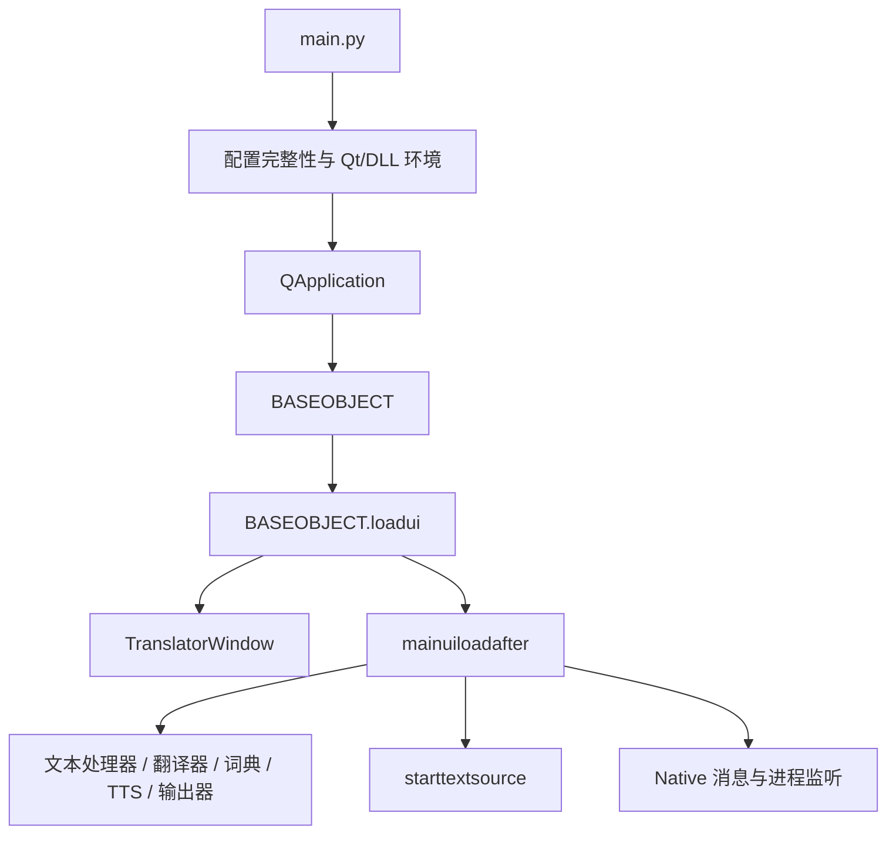
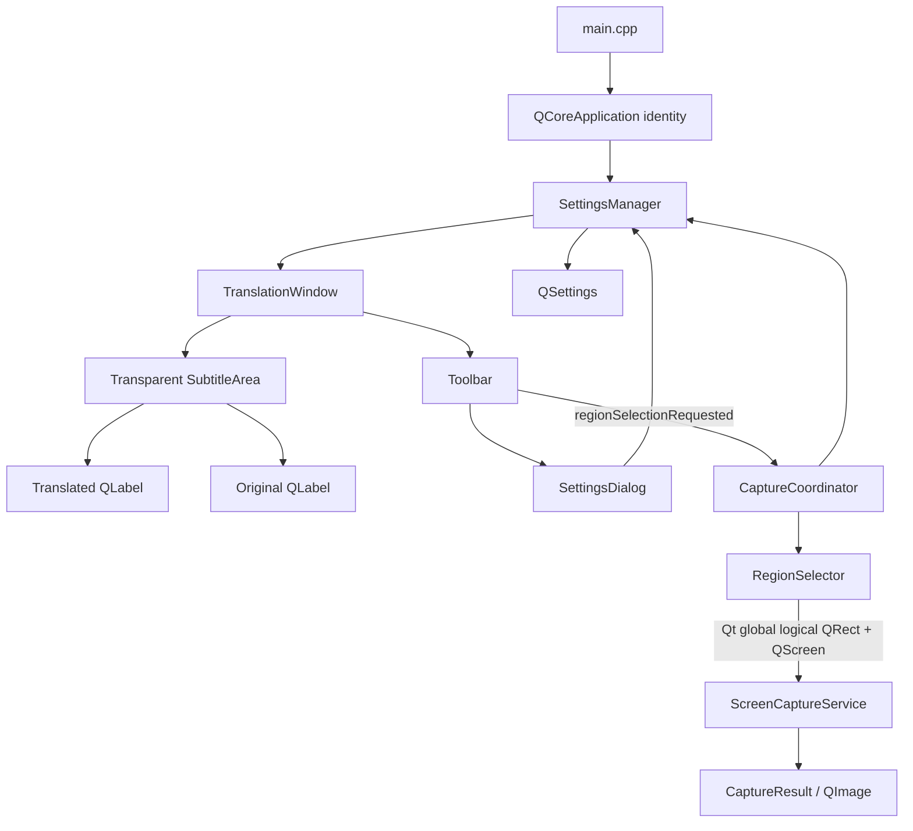
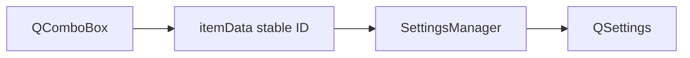

# Translator 架构分析与阶段设计

## 范围

本文基于当前仓库源码的实际调用关系，记录 LunaTranslator 的核心架构，并给出 Translator 的 Qt 6/C++ 模块边界。Phase 1 建立了可配置、可编译、可启动的 Qt Widgets 骨架；Phase 2 增加基础翻译界面和设置持久化。OCR、屏幕捕获、翻译后端、Hook、TTS 和完整实时管线仍不在当前实现范围内。

## 原项目架构

### 启动与应用控制

- `src/LunaTranslator/main.py` 是程序入口。它切换工作目录、解析参数和用户配置目录、检查配置完整性、准备 Qt/DLL 环境、创建 `QApplication`，然后调用 `loadmainui()`。
- `loadmainui()` 在 `gobject.base` 中创建 `LunaTranslator.BASEOBJECT`，并调用 `BASEOBJECT.loadui()`。
- `src/LunaTranslator/LunaTranslator.py` 中的 `BASEOBJECT(QObject)` 是应用级协调器。它持有主窗口、当前文本源、翻译器集合、词典、TTS、输出器、历史记录、网络服务及大量跨模块 Qt 信号。
- `BASEOBJECT.loadui()` 创建 `gui.translatorUI.TranslatorWindow`，显示窗口后调用 `mainuiloadafter()`。后者加载文本处理器、翻译器、词典、分词器、输出器、TTS、设置窗口、历史窗口和当前文本源，并注册 native 消息监听。

这种结构工作上接近“单一应用控制器 + 动态插件集合”，但 `BASEOBJECT` 同时承担生命周期、业务编排、状态和 UI 协调，边界较宽。

### GUI

- `src/LunaTranslator/gui/translatorUI.py` 的 `TranslatorWindow` 是主显示窗口，继承自项目自定义的 `resizableframeless`，而非 `QMainWindow`。它通过 `displayraw1`、`displayraw2`、`displayres`、`displaystatus` 等信号接收跨线程更新。
- `TranslatorWindow.initsignals()` 把这些信号连接到 `showraw()`、`updateraw()`、`showres()`、`showstatus()` 等 UI 方法。
- `src/LunaTranslator/gui/textbrowser.py` 及 `gui/rendertext/` 负责文本呈现；设置、Hook 选择、历史、查词等功能分别位于 `gui/setting/`、`gui/selecthook.py`、`gui/transhist.py`、`gui/showword.py`。
- GUI 同时大量调用 `windows.py` 和 `NativeUtils.py` 完成置顶、无边框效果、窗口跟随、进程绑定和系统消息处理。

### Text Source

- `src/LunaTranslator/textio/textsource/textsourcebase.py` 的 `basetext` 是文本源基类。构造时把 `self.textgetmethod` 绑定到全局 `gobject.base.textgetmethod`；所有来源最终经 `dispatchtext()` 进入同一处理入口。
- `copyboard.py` 监听 `BASEOBJECT.clipboardcallback`，收到剪贴板文本后调用 `dispatchtext()`。
- `texthook.py` 通过 `LunaHost32.dll`/`LunaHost64.dll` 注册 native 回调。`handle_output()` 过滤已选择的 Hook，单路直接提交，多路先合并，再调用 `dispatchtext(..., isFromHook=True)`。
- `ocrtext.py` 维护一个或多个识别区域，在后台循环中按周期、图像变化或按键触发 OCR，得到文本后调用 `dispatchtext()`。
- `mssr.py` 从 Windows Live Captions/语音识别子进程取得文本后提交；`filetrans.py` 和 `copyboard.py` 分别覆盖文件与剪贴板来源。
- `BASEOBJECT.starttextsource()` 根据 `globalconfig["sourcestatus2"]` 在 OCR、剪贴板、Hook、文件翻译和 MSSR 中选择一个活动文本源，并在切换时终止旧实例。

### 屏幕捕获与 OCR

- `ocrtext.rangemanger` 从 `gui.rangeselect.rangeadjust` 获取屏幕矩形。
- `ocrtext.imageCutEx()` 调用 `myutils.ocrutil.imageCut()`；后者调用 `NativeUtils.GdiCropImage()`，通过 `ctypes` 进入 `NativeUtils.dll`。
- native 实现在 `src/NativeImpl/NativeUtils/screenshot.cpp`，使用 Win32 GDI（如 `GetDC`、`BitBlt`）抓取窗口或屏幕区域；仓库也包含基于 Windows Graphics Capture、D3D11 的 `winrt/winrtsnapshot.cpp`。
- `myutils.ocrutil.ocr_init()` 根据 `globalconfig["ocr"]` 动态导入首个启用的 `ocrengines.<name>.OCR`；`ocr_run()` 调用所选引擎的 `_private_ocr()`。
- `ocrengines/baseocrclass.py` 的 `baseocr` 负责语言映射、最小图像尺寸、图像编码、API key 包装和结果标准化；`OCRResult`/`OCRResultParsed` 负责文本框排序、行合并、方向和 OCR 错字替换。
- `ocrtext.getallres()` 合并多个区域。如果引擎返回 `isocrtranslate`，结果直接显示为“不再翻译”的文本；否则返回普通文本，由文本源提交至统一翻译流程。

### 文本与语言处理

- `src/LunaTranslator/myutils/post.py` 的 `POSTSOLVE()` 按配置顺序执行去重、正则替换、字符清理、用户脚本等源文本预处理，并区分 Hook 专用规则和外部调用。
- `BASEOBJECT.solvebeforetrans()` / `solveaftertrans()` 调用 `src/LunaTranslator/transoptimi/` 下动态加载的翻译前后处理器，例如专有名词替换、标点跳过和译文纠错。
- `src/LunaTranslator/language.py` 定义内部语言对象与标准代码；`myutils.commonbase.commonbase` 为 OCR、翻译等插件提供统一的源/目标语言和各服务语言代码映射。
- `myutils.mecab`、中文分词和 Latin 解析器为 GUI 注音、分词和查词提供分析结果，它们不是主翻译请求的必经步骤。

### Translator

- `BASEOBJECT.prepare()`/`commonloader()` 根据 `globalconfig["fanyi"]` 和排名配置动态导入 `translator.<name>.TS`，实例保存在 `self.translators`。
- `src/LunaTranslator/translator/basetranslator.py` 的 `basetrans` 是翻译器基类。每个实例拥有独立优先队列和 daemon worker 线程。
- `gettask()` 入队；`_fythread()` 处理取消旧请求、初始化/重初始化、语言映射、缓存和异常；`translate_and_collect()` 调用具体引擎的 `translate()`，并把普通结果或流式结果交给回调。
- `BASEOBJECT.GetTranslationCallback()` 校验请求签名，执行译后处理，更新历史/数据库/文本输出器，并通过 `TranslatorWindow.displayres` 信号回到 GUI。
- `rengong`（人工翻译文件）和 `premt`（预翻译数据库）在一般翻译器入队前同步查询，可按配置命中后跳过其他引擎。

### Configuration

- `src/LunaTranslator/myutils/config.py` 从 `src/LunaTranslator/defaultconfig/` 读取默认 JSON，从 `userconfig` 读取用户 JSON，再通过 `syncconfig()` 合并和迁移。
- 主要状态包括 `globalconfig`、`ui_settings`、`translatorsetting`、`ocrsetting`、`postprocessconfig` 和按游戏保存的 `savehook_new_data`。
- `saveallconfig()` 先写 `.tmp` 再 `os.replace()`，以降低配置写入中断造成损坏的风险。
- `src/LunaTranslator/gobject.py` 保存全局 `base`、用户配置目录、缓存目录和按运行时位数解析 native DLL 的逻辑。

### 线程与异步处理

- `myutils.wrapper.threader` 为函数创建 Python daemon thread，应用初始化、OCR 循环、Hook 监控、TTS、词典和网络任务广泛使用它。
- 每个 `basetrans` 使用一个优先队列 worker；非离线翻译还会再运行可中断的 `Threadwithresult`，新请求可使旧请求失效。
- `basetext` 用队列线程异步写 SQLite；同步等待嵌入翻译时使用一次性 `queue.Queue`。
- 后台线程不直接更新控件，而是发射 PyQt 信号；`currentsignature` 用于丢弃已经过期的翻译回调。

## 原项目核心调用链

### 启动与初始化

### OCR 到翻译与显示

Hook、剪贴板、文件和语音识别来源从各自回调进入 `basetext.dispatchtext()`，之后共享同一条文本处理与翻译链。OCR 引擎若自身已经返回译文，则通过 `displayinfomessage(..., "<notrans>")` 直接显示，不进入普通翻译器链。

## Phase 2.5 字幕 UI 与 Phase 3 捕获架构

Phase 2.5 将传统设置主窗口重构为字幕悬浮窗；Phase 3 在独立捕获层接入真实选区和单帧截图：

`main.cpp` 在创建配置对象前设置 organization/application name，并通过构造函数把唯一的 `SettingsManager` 实例传给 `TranslationWindow`。`TranslationWindow` 持有唯一的 `SettingsDialog`；设置对话框通过同一 `SettingsManager` 读写配置，不直接创建或分散使用 `QSettings`。

配置流如下：

当前稳定 ID 为语言代码 `auto`、`zh`、`en`、`ja`、`ko`，OCR engine 为 `windows_ocr`，Translator 为 `none`。`SettingsManager` 在读取时验证值；缺失、非法或已经移除的 ID 会回退到默认值并写回配置。

`TranslationWindow` 是 `QWidget` 顶层窗口，使用 `Qt::FramelessWindowHint`、`Qt::WindowStaysOnTopHint` 和 `Qt::WA_TranslucentBackground`。主体 `SubtitleArea` 不绘制背景，按“译文在上、原文在下”排列两个自动换行的 `QLabel`，并以高对比文字和轻量阴影保障可读性。半透明工具栏在鼠标进入窗口时显示，离开后延迟检查全窗口命中范围再隐藏，以避免经过子控件时闪烁。

为避免透明空窗口在启动时无法发现，两个字幕字段各自维护 UI placeholder 状态并初始显示位置提示文字。Toolbar 启动时隐藏，鼠标进入整个窗口区域时显示，离开后延迟 400ms 检查全局光标是否确实位于窗口外。任一 setter 首次收到非空文本时只替换对应字段的 placeholder；placeholder 不写入 `SettingsManager` 或后续业务数据流。

工具栏空白区域和字幕区域通过 `QWindow::startSystemMove()` 请求系统移动窗口，字幕区域边缘使用 `startSystemResize()`。按钮区域仍保持正常点击。窗口关闭时用 `saveGeometry()` 写入 `window/geometry`；恢复后若窗口矩形与所有屏幕的 `availableGeometry()` 均不相交，则回退到默认的宽屏字幕尺寸并居中到主屏。

### Phase 3 坐标与时序

`main.cpp` 创建一个轻量 `CaptureCoordinator`，连接 `TranslationWindow::regionSelectionRequested()`、`RegionSelector` 和 `ScreenCaptureService`。窗口只发 UI 请求；选择器只产出所选 `QScreen` 与 **Qt global logical coordinates** 的 `QRect`；截图服务只产出 `CaptureResult`，不认识字幕 UI。

每块 `QScreen` 各有一层单屏选择 overlay。拖动起点决定当前屏幕，终点限制在该屏幕内；本阶段不跨不同 DPI 的屏幕选区。`ScreenCaptureService` 先验证 `screen->geometry().contains(globalRect)`，再减去 `screen->geometry().topLeft()` 得到 screen-local logical rect，传给 `QScreen::grabWindow(0, x, y, w, h)`。负的显示器全局坐标是合法的；不能假定屏幕原点为 `(0,0)`。Qt 返回的 `QPixmap` 转为 `QImage`，记录逻辑选区、实际图像像素尺寸和 `QScreen::devicePixelRatio()`；不凭猜测手工乘除 DPR。

点击 Region 时先隐藏字幕窗，稍后显示 overlay。松开鼠标后先隐藏所有 overlay，再延迟 150ms 截图，此时字幕窗仍隐藏；成功或失败均恢复字幕窗。Escape、右键、过小/无效矩形取消选择，不覆盖之前有效 Region，也不截图。成功选区以 `QRect` QVariant 和屏幕名称分别保存在 `capture/region`、`capture/screen`，启动时仅验证恢复，不自动截图。Debug 构建只在本地系统临时目录覆盖 `Translator/last_capture.png`；不联网、不存历史。当前优先保证正确性，高性能 Windows capture backend 待实时阶段评估。

## Qt 6/C++ 版本架构

### 设计原则

- 保留“统一文本源接口、可替换 OCR/翻译引擎、统一管线、信号驱动 GUI、按配置选择实现”的思想。
- 将 `BASEOBJECT` 的职责拆分，避免新的全局单例同时拥有所有服务和 UI。
- 用明确的 C++ 接口和所有权替代 `importlib`、模块级全局变量和 `ctypes` 回调；插件是否需要动态库 ABI，待具体后端确定后再决定。
- 用 Qt queued signal/slot、`QThread` 或 `QThreadPool` 表达异步边界，并为每次管线请求携带 request id/cancellation token，保留“过期结果不回写”的语义。
- 领域结果使用值类型，例如 `CapturedFrame`、`RecognizedText`、`TranslationRequest`、`TranslationResult`，避免用无结构字典穿过模块边界。

### 计划目录与职责

| 目录 | 计划职责 | 当前状态 |
| --- | --- | --- |
| `src/app/` | 应用生命周期、依赖组装、管线协调 | 已实现小型 `CaptureCoordinator` |
| `src/gui/` | 悬浮翻译窗口、设置界面及后续 overlay 交互 | 已实现 `TranslationWindow` 与 `SettingsDialog` |
| `src/capture/` | 区域选择、Qt 单帧截图及结果模型 | 已实现 `RegionSelector` 与 `ScreenCaptureService` |
| `src/textsource/` | `ITextSource` 及 OCR/剪贴板/Hook 等来源 | 未实现 |
| `src/ocr/` | `IOcrEngine`、结果模型与引擎选择 | 未实现 |
| `src/processing/` | 源文本预处理、翻译前后处理和管线编排 | 未实现 |
| `src/translator/` | `ITranslator`、调度、缓存与后端 | 未实现 |
| `src/config/` | 配置模型、校验、迁移和持久化 | 已实现基础 `SettingsManager`/`QSettings` |

Phase 3 仍不为后续 OCR、翻译或实时管线边界创建空类。当前构建目标只包含已经实际使用的 GUI、配置和捕获代码。

### 建议运行时关系

Phase 4 可直接消费 `CaptureResult::image` 作为 OCR 输入，再将识别文本送到 `TranslationWindow::setOriginalText()`。后续翻译结果进入 `setTranslatedText()`。GUI 不应直接选择 native DLL 或调用具体服务；OCR/翻译编排类型等真正接入后端时再建立。

## 原模块到新模块映射

| LunaTranslator 原模块 | Translator 目标模块 | 迁移策略 |
| --- | --- | --- |
| `main.py`、`gobject.py` | `main.cpp`、`src/app/` | 保留启动顺序；全局状态改为显式对象所有权与依赖注入 |
| `BASEOBJECT` | `ApplicationController` + 管线/管理器 | 拆分生命周期、状态、翻译调度和 UI 协调职责 |
| `gui/translatorUI.py`、`gui/rendertext/` | `src/gui/` | 使用独立 Qt Widgets 悬浮窗和设置对话框，不复制原项目视觉资源 |
| `textsourcebase.py` 与各文本源 | `src/textsource/` | 抽象 `ITextSource`，用 typed signal 发布输入 |
| `ocrtext.py`、`rangeselect.py` | `src/textsource/` + `src/capture/` + `src/gui/` | 分离触发策略、图像捕获和区域 UI |
| `ocrutil.py`、`ocrengines/` | `src/ocr/` | 保留统一结果和引擎选择；用 C++ 接口/工厂替代动态 Python import |
| `post.py`、`transoptimi/` | `src/processing/` | 保留有序处理链；处理器使用类型化上下文 |
| `basetranslator.py`、`translator/` | `src/translator/` | 保留队列、缓存、流式结果和排名；改用 Qt/C++ 并发与取消机制 |
| `language.py`、`commonbase.py` | `src/processing/` + 公共领域类型 | 保留标准语言标识与每引擎映射，移除全局配置读取 |
| `myutils/config.py`、默认 JSON | `src/config/` | 使用 `QJsonDocument`/`QSettings` 或明确 JSON schema；保留原子写入和迁移 |
| `NativeUtils.py`、`windows.py` | `src/capture/` 及后续 `src/platform/windows/` | 用 RAII C++ 封装 Win32 句柄和回调，平台代码与领域接口隔离 |
| `NativeImpl/LunaHook` | 后续独立 Hook adapter | 作为可选 Windows 子系统评估，不在 Phase 1 链接 |

## Native Dependencies

以下依赖来自源码和 native CMake，Phase 1 均未迁移或链接。

### Windows API 与系统组件

- User32、Kernel32、GDI/GDI+：窗口枚举、前台窗口、键盘状态、进程、剪贴板监听、`GetDC`/`BitBlt` 截图、DLL 加载与注入。
- DWM、ShCore：Aero/Acrylic、DPI 和窗口外观。
- Windows Graphics Capture、D3D11/D3D12、DXGI：现代窗口捕获与本地 OCR/GPU 能力探测。
- WinHTTP、Winsock/libcurl 路径：网络请求与 WebSocket。
- Media Foundation、MMDevice/WASAPI、SAPI：进程音频捕获、语音识别输入和 Windows TTS。
- WebView2/MSHTML：富文本/网页渲染后端。

### Native DLL、扩展与 Hook

- `NativeUtils.dll`：截图、窗口效果、剪贴板、进程/音量、SAPI、WebView、MeCab 等通用 native 能力，由 `NativeUtils.py` 经 `ctypes.CDLL` 调用。
- `CVUtils.dll`：本地 OCR、图像相似度及 ONNX/OpenCV 包装，由 `CVUtils.py` 加载。
- `LunaHost32.dll` / `LunaHost64.dll`：Python 与 Hook host 的 C ABI 桥接。
- `LunaHook32.dll` / `LunaHook64.dll`：注入目标进程的游戏文本 Hook。
- `LunaSubprocess` 及辅助可执行文件：跨位数 DLL 注入、OCR/TTS/语音识别等隔离任务。
- Python runtime、PyQt5/PyQt6 与 `ctypes` 是当前应用层和 native 层之间的重要运行时依赖。

### OCR 与其他第三方组件

- 本地 OCR 路径使用 OpenCV、ONNX Runtime，并包含 D3D12/OpenVINO provider 探测；模型以外部资源形式管理。
- 可选 OCR 后端包括 Tesseract 5 可执行程序、Windows OCR/Snipping Tool、WeChat OCR，以及多个在线 OCR 服务。
- native 构建还引用 MeCab、MinHook、BASS、md4c、RapidFuzz、Clipper2、tiny-AES、protobuf 和 `magic_enum`。
- 翻译层包含在线 HTTP API、浏览器/CDP、离线翻译器和预翻译/人工翻译数据库；网络层可走 WinHTTP 或 libcurl。
- SQLite 用于翻译记录、预翻译和统计数据。

这些依赖不能直接等同于 Qt 版本的最终选型。后续阶段应先定义接口和最小闭环，再逐项评估可复用 native 代码、重新封装或替换实现。
