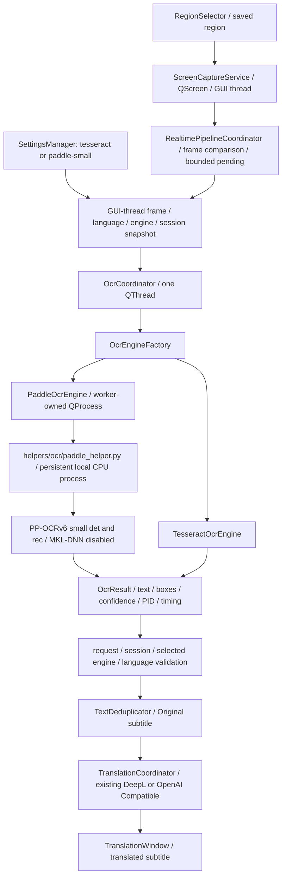

# Phase 6.1B: Persistent PP-OCRv6 Small Integration

## Scope and History

Implemented only in Translator; LunaTranslator remains a read-only reference.
Starting branch was clean `main` at `bf980f88672bf8845349eb687d931202527bb6d5`,
with Phase 6 `5cfe81b51e080e272f4977fa4ed0ea2a71c01895` in history. No reset,
subagent, worktree, packaging, installer, ASR, Hook or TTS work was performed.

## Production Path



`main.cpp` snapshots helper options, supplies the selected-engine factory and
retains the existing UI/service wiring. No capture/OCR backend is implemented
inside TranslationWindow. Settings persists only `ocr/engine`; image bytes,
recognized text and helper state are not stored in QSettings.

`OcrCoordinator` constructs, uses, switches and destroys the engine on its worker
thread. QProcess never blocks the GUI thread. SettingsManager is not consulted
from that thread. Each frame carries the engine ID with its session snapshot.
Changing engine invalidates pending/old-generation results, including translation.
The physical old OCR can complete before the new engine is constructed; at most
one request executes with one latest pending frame. Switching kills the previous
resident helper before a replacement is started. Legacy factory API is retained
for existing tests, not used to select the production backend.

## Helper Protocol and Lifecycle

- Request: 4-byte big-endian JSON-header length, UTF-8 JSON, then raw RGB888 rows.
- Metadata: protocol 1, recognize type, string request ID, width, height, stride,
  pixel byte count, format and source-language hint. QImage alignment padding is
  preserved; Python strips it and converts RGB to contiguous BGR for Paddle.
- Response: 4-byte big-endian JSON length and UTF-8 JSON; ready/result/error.
  Ready validates the engine and explicit `mkldnn=false`. Results must match the
  request identity, contain text, quadrilateral boxes, matching scores and timing.
- Header limit 16 KiB; pixels 64 MiB; response 4 MiB; dimensions at most 16384.
  Truncated, oversized, malformed or wrong-identity replies fail explicitly.
- Native/Python stdout is redirected to stderr before loading Paddle, keeping
  stdout exclusively binary. Stderr is drained to bounded diagnostics and Qt
  logging; Qt Creator can display these logs. Startup logs explicitly contain
  `MKL-DNN disabled`. Normal logs do not print image buffers or recognized text;
  Debug OCR diagnostics report character counts rather than full recognized text.
- Models load lazily on the first OCR request, once per helper. Stop retires results
  but keeps the process warm. Close requests worker interruption; waits are polled
  in at most 50 ms chunks, then the process is killed and reaped. No cancel-inference
  protocol or per-frame subprocess is used.
- Startup deadline 30 seconds, per-request deadline 10 seconds including IPC.
  Failure kills the process. Subsequent requests restart after exponential backoff
  from 1 second up to 30 seconds; no unbounded retry queue. A valid empty result is
  different from an error. Errors retain prior subtitles, never fabricate OCR text.
- No silent Tesseract fallback. Users select it in Settings on errors or for Korean.
  Existing saved/default Tesseract selection is preserved. All Paddle selections
  use small; medium is not present in the production factory.

## Local Runtime

Runtime is an external local Python process, not Python linked into the Qt binary.
The MinGW Qt app crosses the MSVC Paddle boundary only through OS pipes.
Current verified packages: PaddleOCR 3.7.0, PaddlePaddle CPU 3.3.1, PaddleX 3.7.2.
`helpers/ocr/requirements.txt` records these versions, not an installer.

Checkout discovery checks executable ancestors and then current-directory ancestors
for `helpers/ocr/paddle_helper.py`. Defaults reuse the existing ignored Phase 6.1A
venv and model directory. Environment overrides (absolute paths recommended):

```powershell
$env:TRANSLATOR_OCR_PYTHON = '<local venv>/Scripts/python.exe'
$env:TRANSLATOR_OCR_HELPER = '<checkout>/helpers/ocr/paddle_helper.py'
$env:TRANSLATOR_OCR_MODELS = '<local models directory>'
```

The models directory must contain `PP-OCRv6_small_det` and `PP-OCRv6_small_rec`,
each with exactly one inference.yml and adjacent inference.json/pdiparams.
No models, dependencies or videos are downloaded by the application. Missing
assets fail with an actionable error. The helper does not import benchmark tooling.
Only a limited OS environment is passed to Python, excluding translator credential
variables; local cache stays in ignored `.cache/ocr-helper/`. Provider credentials
remain in the existing credential store and existing Qt translation layer.
OCR pixels remain local; selected online translation still sends recognized text.

Chinese video crops establish Chinese quality only. Auto/zh/en/ja use the same
multilingual recognition model; a language hint is validated, not passed as an
unsupported Paddle constructor parameter. This phase does not establish Japanese,
English, Korean, artistic-font, mixed-DPI or continuous-video accuracy.

## Verification on 2026-10-05

Configure/build, using local paths only on the command line:

```powershell
$env:PATH = 'D:\QT\Tools\mingw1310_64\bin;D:\QT\6.11.2\mingw_64\bin;' + $env:PATH
& 'D:\QT\Tools\CMake_64\bin\cmake.exe' -S . -B build/phase61b -G Ninja `
  -DCMAKE_BUILD_TYPE=Release -DCMAKE_PREFIX_PATH=D:/QT/6.11.2/mingw_64 `
  -DCMAKE_CXX_COMPILER=D:/QT/Tools/mingw1310_64/bin/g++.exe `
  -DCMAKE_MAKE_PROGRAM=D:/QT/Tools/Ninja/ninja.exe `
  -DPython3_EXECUTABLE=D:/workspace/Project/Usst/Translator/benchmarks/ocr_phase61a/.venv/Scripts/python.exe
& 'D:\QT\Tools\CMake_64\bin\cmake.exe' --build build/phase61b --parallel 6
& 'D:\QT\Tools\CMake_64\bin\ctest.exe' --test-dir build/phase61b --output-on-failure
```

Configure/build succeeded. Optional Vulkan headers warning is not a Widgets error.
Additional Debug configure/build in `build/phase61b-debug` with the same toolchain,
`-DCMAKE_BUILD_TYPE=Debug -DBUILD_TESTING=OFF`, also succeeded. The production
Release `Translator.exe` was launched, its transparent placeholder window observed
through Computer Use, then closed using its Close button. No Translator, probe or
Python helper processes remained. This smoke check is not a Qt Creator launch.
The initial 10 CTest suites passed, including 6 stdlib helper protocol checks and existing
18 benchmark harness checks. Native tests cover RGB stride, fragmented messages,
request identity, empty/error distinction, invalid scores, crash, malformed/large
responses, missing runtime, timeouts, backoff recovery, external termination,
worker engine switching, destructor child cleanup and interrupted Close. Realtime
tests explicitly reject old-engine OCR and reprocess unchanged pixels after switching.
The fixture initially buffered stdin and blocked short requests; using unbuffered
native fixture I/O fixed the test without weakening production contracts.

Opt-in `TranslatorPaddleProbe` uses real production engines/coordinators. It is
not a CTest dependency and never embeds private samples. Reports/screenshots are
written only to local ignored benchmark results when explicitly requested.

1. Native batch: same 10 user-confirmed Phase 6.1A crops, two calls each. All 20
   IPC requests succeeded with one PID (24496). Exact 9/10; sample 010 still yields
   the extra `0`, just as in Phase 6.1A. Cold first request 4587 ms; subsequent 19
   calls median 189 ms, mean 202.95 ms, range 160-278 ms. No accuracy regression.
2. Real desktop capture: three paused-video crops displayed in a native QLabel
   above/outside the subtitle window; pipeline uses its default QScreen capture,
   not an injected image source. Input 1070x97, all three recognized correctly,
   same PID (17216), first 3286 ms, warm 171/159 ms. 65 captures, 62 unchanged
   frames, 1033 GUI timer heartbeats across 21 seconds; Stop halted capture.
3. The same desktop run used real configured DeepL credentials through the existing
   store without printing/exporting keys. Three HTTP 200 responses, 1150/419/368 ms.
   Original/translation QLabel values matched their real results, both visible.
4. Computer Use separately opened Settings, selected Small, opened Region overlay,
   canceled with Escape (window restored) and clicked Start. It cannot reliably
   target the Qt Tool overlay as an independent window for dragging; the manual
   probe timed out during the later startup. This does NOT establish successful
   mouse-drag Region acceptance, nor Qt Creator launch or continuous Bilibili playback.

Final post-build desktop repeat also passed: PID 26120, 69 captures / 66 unchanged,
1099 heartbeats in 22.22 seconds, first OCR 4650 ms, warm 174/194 ms. All three
DeepL responses HTTP 200 (1251/427/339 ms), actual subtitle widgets matched the
results, and Stop halted capture. `phase61b-live-final.json.png` in ignored local
results shows the translated and original subtitles after Stop. This rendered
widget image does not include the surrounding desktop. No helper Python process
remained after probe exit; original LunaTranslator `git status --short` was empty.

Examples (private local inputs required):

```powershell
.\build\phase61b\TranslatorPaddleProbe.exe --batch <ignored-output.json> <crop1.png> <crop2.png>
.\build\phase61b\TranslatorPaddleProbe.exe --live <ignored-output.json> <crop1.png> <crop2.png> --deepl
.\build\phase61b\TranslatorPaddleProbe.exe --manual <ignored-output.json> <crop.png> --deepl
```

Live/manual probes use temporary QSettings, not user settings. DeepL requests
are real and opt-in; leave off `--deepl` for local OCR only. The helper receives
no credentials. Private images/raw OCR reports and rendered screenshots remain
ignored, are not committed or uploaded. Long-duration memory stability, actual
continuous-video acceptance, manual drag/Qt Creator acceptance and standalone
distribution remain outstanding. Phase 6.1C has not begun.

## Real-video Manual Testing

User-reported manual testing of real video confirms that PP-OCRv6 Small can
recognize visible subtitles normally and is noticeably more useful than
Tesseract in this scenario. The 10 user-verified Bilibili subtitle crops and
desktop-capture/DeepL checks above provide separate reproducible evidence.
This is not a claim of perfect recognition, an automated continuous-video
benchmark, or successful no-subtitle suppression.

## Known Limitation: No-subtitle False Positives

Complex video backgrounds without subtitles can occasionally produce one or
several false short characters. A valid nonempty result currently reaches
Original and can trigger DeepL, even if the user sees no subtitle. This is an
acknowledged OCR-quality limitation, not a helper process error. It is not fixed
and, by user direction, does not block Phase 6.1B production integration.

Phase 6.1B.1 adds optional per-box text metadata and an opt-in native analysis
tool, retained without changing production recognition/acceptance behavior.
Current positive-only data includes a false box scoring 0.949125, so a guessed
confidence threshold is not sufficient evidence. **Phase 6.1B.1 production
filtering is deferred.** No new confidence threshold, geometry gate, minimum
character count or temporal confirmation is enabled. Existing empty debounce,
TextDeduplicator responsibility and bounded queue behavior remain unchanged.
See [the archived preliminary analysis](ocr-false-positive-phase61b1.md).

## Final Integration Regression

Release and Debug builds were rerun successfully before the Phase 6.1B commit;
Ninja found both build trees up to date. `ctest --test-dir build/phase61b
--output-on-failure` passed all 11 suites (8.44 seconds). The extra suite tests
only the offline analysis tool; it is not a claim
that production false-positive filtering exists. Native tests cover selected
Tesseract fallback, engine switching, persistent helper reuse, crash/recovery,
timeouts, old/malformed optional metadata and interrupted Close with child
cleanup. Phase 6 tests preserve Stop/Start and session/queue contracts.
The final real-model batch repeated all 10 private crops twice: 20/20 successful
requests with a single helper PID 17196, no process restart, no errors and no
translation requests. Cold first request was 3582 ms; warm requests ranged from
176 to 295 ms. The batch exited cleanly. No quality policy changed between this
run and the earlier positive regression.
Private screenshots, manifests, models, venvs, binaries and raw logs stay local
and ignored. Phase 6.1C is not part of this commit.
